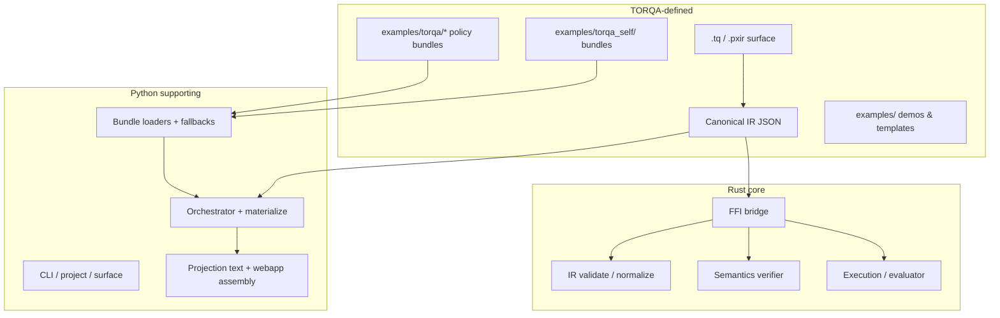

# TORQA dominance (P30 milestone)

This document is the **architecture snapshot** for the “~90% TORQA-driven” milestone: **what is authored in TORQA** (`.tq` → IR bundles, metadata) versus what stays in **Python (glue)** and **Rust (core engine)**. It complements positioning rules in [ARCHITECTURE_RULES.md](ARCHITECTURE_RULES.md) and the self-host inventory in [SELF_HOST_MAP.md](SELF_HOST_MAP.md).

---

## 1. One-sentence model

**Authors and operators express intent in TORQA** (surface + committed bundles). **Python runs the product** (CLI, orchestration, loading bundles, codegen glue). **Rust accelerates** IR handling, execution, and structural checks where the core benefits.

We **do not** aim for 100% of bytes to live in `.tq`; critical invariants and schema remain in code on purpose.

---

## 2. Layer diagram

---

## 3. Classification: TORQA-driven

| Area | Mechanism | Primary locations |
|------|-----------|-------------------|
| **Authoring surface** | `.tq` grammar → `ir_goal`; `parse_pxir` for transitional surface | `src/surface/parse_tq.py`, `parse_pxir.py`, `docs/TQ_SURFACE_MAPPING.md` |
| **Self-host policy** | Committed `.tq` + JSON bundles; registry lists pairs | `examples/torqa_self/*.tq`, `bundle_registry.py`, `src/torqa_self/*_ir.py` |
| **CLI / language hints** | Slug order + merge caps from bundles; Python maps slugs → strings | `user_hints`, `onboarding_ir`, `validate_open_hints_ir`, … |
| **Projection layout (stubs)** | `stub_path` in `.tq`; default paths from policy bundle | `projection_stub_paths_policy.tq`, `stub_paths_layout.py`, `artifact_builder.generate_stub_artifact` |
| **Semantic advisories** | Policy slugs in bundle + per-goal `metadata.source_map` | `semantic_warning_policy.tq`, `torqa_semantic_policy.py`, `validate_ir_semantics` (warnings only) |
| **Examples / demos** | First-class `.tq` and workspace scaffolds | `examples/torqa/`, `examples/workspace_minimal/`, templates |

---

## 4. Classification: Python-only (glue / orchestration)

| Area | Role | Notes |
|------|------|--------|
| **CLI** | Argument parsing, exit codes, JSON/human mode | `src/cli/main.py` |
| **Pipeline** | validate → execute → project stages | `project_materialize.py`, `system_orchestrator.py` |
| **Diagnostics assembly** | Full reports, AEM codes, formal phases wiring | `diagnostics/report.py`, `formal_phases.py` |
| **Codegen bodies** | Rust/Python/SQL/TS/Go/Kotlin/C++ **text** from IR | `codegen/ir_to_projection.py`, `artifact_builder.py` (paths TORQA-driven where noted) |
| **Projection strategy scoring** | Heuristic target selection (not yet a TORQA bundle) | `projection_strategy.py` — candidate for future policy |
| **Packages / registry** | npm-style packaging, merge, vendor | `src/packages/` |
| **Bridge** | Load Rust shared lib, call FFI | `bridge/rust_bridge.py`, `rust_structural_validation.py` |
| **IR schema & invariants** | Canonical shape, version, mandatory metadata keys | `canonical_ir.py` validation / handoff |

---

## 5. Classification: Rust-core

| Area | Role | Primary locations |
|------|------|-------------------|
| **IR** | Goal/expr types, normalize, validate | `rust-core/src/ir/` |
| **Semantics** | Symbol table, guarantees, verifier (warnings/errors) | `rust-core/src/semantics/` |
| **Execution** | Planner, runtime, evaluator | `rust-core/src/execution/` |
| **Projection codegen** | Rust-side projection helpers | `projection_codegen/`, `projection/strategy.rs` |
| **FFI** | JSON in/out for Python | `ffi/mod.rs` |

Rust semantic **warnings** are not yet wired to the Python TORQA policy bundle (P29); parity is a possible follow-up.

---

## 6. What “majority TORQA-defined” means here

Rough **intent** (not a line count):

- **Surface rules** for authors: TORQA (`.tq` + docs).
- **Product copy ordering / caps / hint structure** for CLI and `torqa language`: TORQA bundles under `examples/torqa_self/` with Python string bridging.
- **Default stub file paths**: TORQA policy + optional `stub_path` on each flow.
- **Non-blocking semantic policy**: TORQA policy bundle + IR `metadata.source_map` overrides.
- **Blocking semantics** (unknown effect, arity, guarantee gaps for forbids/reads): **Python** (and Rust parallel) — **not** policy-toggleable.

So the **behavior authors feel** — what to write, what hints they see, where files land, which advisories fire — is **largely table-driven from TORQA artifacts**. The **engine** that checks safety stays in code.

---

## 7. How to extend without breaking the model

1. Prefer **new rows** in existing policy `.tq` files + regenerate bundles (`torqa surface …`) before committing JSON.
2. For **locked** self-host (`P17.1`), follow [SELF_HOST_MAP.md](SELF_HOST_MAP.md): no new registry pairs without an explicit roadmap phase.
3. For **new policy domains** (like projection stubs or semantic warnings), use **`examples/torqa/`** + a small dedicated loader module; keep **one** Python fallback path.
4. Do not move **schema validation** or **safety-critical** rules into bundles until there is a formal spec for interpreting them.

---

## 8. Verification

Automated checks for this milestone live in **`tests/test_torqa_milestone_p30.py`**: committed bundles exist, parse, and loaders return coherent defaults so key flows remain TORQA-driven in CI.

**P31 benchmark flagship:** end-to-end demo + fixtures — [`BENCHMARK_FLAGSHIP.md`](BENCHMARK_FLAGSHIP.md), **`tests/test_benchmark_flagship_p31.py`**.

---

## 9. Related docs

| Doc | Purpose |
|-----|---------|
| [TQ_SURFACE_MAPPING.md](TQ_SURFACE_MAPPING.md) | Normative `.tq` → IR mapping |
| [SELF_HOST_MAP.md](SELF_HOST_MAP.md) | Self-host bundle inventory |
| [CODEGEN_INVENTORY.md](CODEGEN_INVENTORY.md) | Codegen / projection notes |
| [BENCHMARK_COMPRESSION.md](BENCHMARK_COMPRESSION.md) | P32 token compression metrics (`torqa-compression-bench`) |
| [ARCHITECTURE_RULES.md](ARCHITECTURE_RULES.md) | Product vs Python vs Rust positioning |
