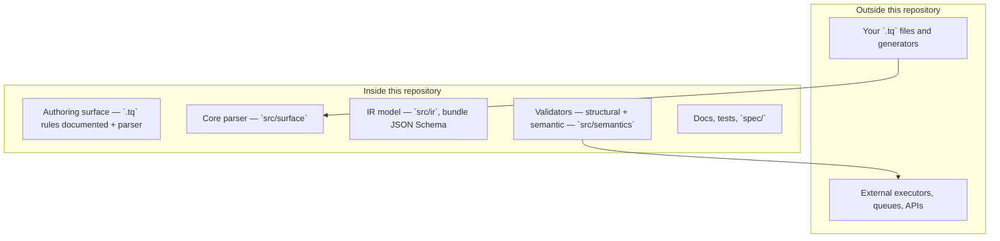
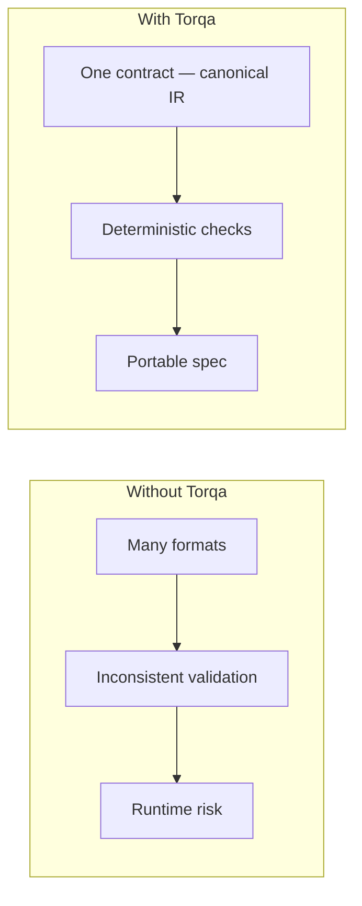
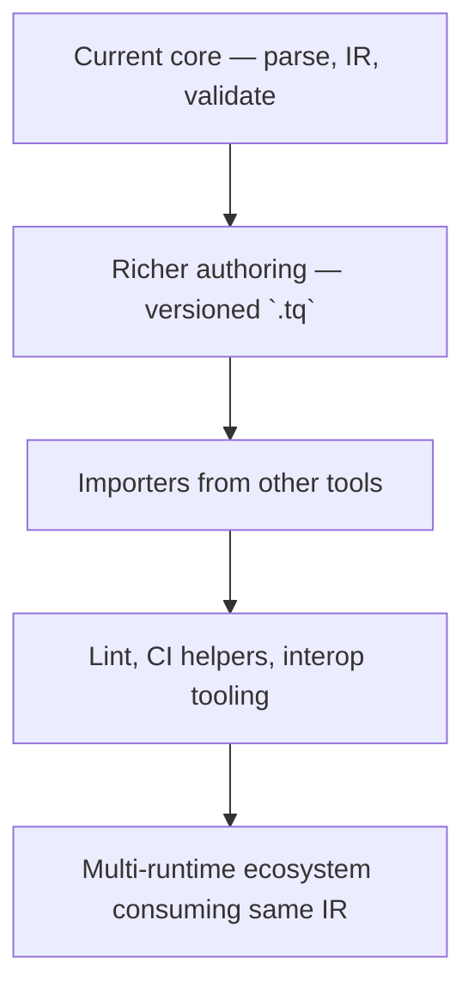

# Diagrams

Torqa is easier to grasp visually: one pipeline from text to checks, a clear **in-repo / out-of-repo** boundary, and how a single contract differs from ad-hoc formats.

---

## Diagram 1 — Core flow

End-to-end path from any workflow source to a handoff **outside** this repository.

```mermaid
flowchart TD
  A[Human / AI / imported workflow]
  B["`.tq` or equivalent input"]
  C[Parser]
  D[Canonical bundle — `ir_goal`]
  E[Structural validation — `validate_ir`]
  F[Semantic validation — registry + logic]
  G[External runtime — yours]

  A --> B
  B --> C
  C --> D
  D --> E
  E --> F
  F --> G
```

Execution happens only at **G**; everything above is specification and verification in the Torqa core.

---

## Diagram 2 — Repository layers

What lives **in this Git repository** versus what you run **elsewhere**.



**In-repo:** parser, canonical IR types, validators, schema, tests, documentation.  
**Out-of-repo:** where files are authored at scale, and anything that **runs** workflows.

---

## Diagram 3 — Why Torqa matters

Contrast at a glance: many informal paths vs one contract and checks.



Torqa does not remove all runtime risk; it **front-loads** spec risk into **repeatable** parse and validation.

---

## Diagram 4 — Future growth

**Possible** directions around the core—not commitments, not a shipped roadmap.



Each step depends on maintainers, users, and scope. See [Roadmap](roadmap.md) and [Language evolution](language-evolution.md) for grounded notes—**not** promises of features or dates.
